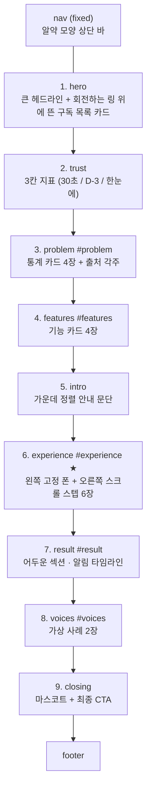

# 틈(TEUM) 온보딩 페이지 — 명세서 묶음

이 폴더의 문서 4개만 있으면 원본 HTML 없이 같은 페이지를 만들 수 있다.
소스코드는 들어 있지 않다. **값·규칙·문구를 전부 명시했으니 그대로 구현하면 된다.**

| 문서 | 내용 | 언제 보나 |
| --- | --- | --- |
| **SPEC_00_README.md** (이 문서) | 전체 개요 · 읽는 순서 · 준비물 | 맨 처음 |
| **SPEC_01_CONTENT.md** | 화면에 나오는 **모든 문구 원문**, 등장 순서대로 | 마크업 짤 때 |
| **SPEC_02_DESIGN.md** | 색·타이포·레이아웃 실측값·컴포넌트 30종·반응형·다크모드·모션 | 스타일 짤 때 |
| **SPEC_03_FUNCTIONAL.md** | 상태 모델·이벤트·알고리즘·검증 규칙·예외 | 동작 붙일 때 |

---

## 1. 이 페이지가 뭔가

**틈 서비스의 "구독 등록" 흐름을 스크롤로 미리 체험시키는 온보딩 페이지.**

방문자가 아래로 스크롤하면 화면 왼쪽에 고정된 **폰 목업이 한 단계씩 저절로 채워진다.**
오른쪽에는 그 단계를 설명하는 카드가 지나간다. 가입·설치 없이 30초 만에
"틈에서 구독 하나 등록하는 게 이런 거구나"를 손으로 익히게 만드는 것이 유일한 목적이다.

폰 목업은 장식이 아니다. **Figma 기능명세서의 실제 화면(SP-SB-Edit-00 ~ 09)을 그대로 재현**한 것으로,
실서비스와 같은 입력 규칙·상태 전이·예외 처리를 가진다. 사용자가 직접 타이핑할 수도 있다.

### 이게 아닌 것

| 아닌 것 | 설명 |
| --- | --- |
| 랜딩 페이지 | 가입 전환이 목적이 아니다. **학습**이 목적 |
| 실제 등록 폼 | 백엔드 없음. 저장은 토스트만 띄우고 끝. 어디에도 전송·저장되지 않음 |
| 로그인 있는 화면 | 인증·세션·쿠키 없음 |
| 프레임워크 앱 | 빌드 스텝 없음. HTML 파일 하나 + 이미지 폴더 |

---

## 2. 기술 전제

| 항목 | 값 |
| --- | --- |
| 구성 | HTML 1개 파일 (CSS·JS 모두 인라인) + `assets/` 이미지 폴더 |
| 프레임워크 | 없음. 바닐라 |
| 외부 의존성 | Google Fonts(Noto Sans KR) 하나뿐 |
| 언어 | 한국어 전용 |
| 지원 | 모던 브라우저. `IntersectionObserver`, CSS 변수, `aspect-ratio`, `backdrop-filter` 사용 |
| 파일 크기 참고 | HTML 약 63KB, 이미지 약 730KB |

### 필수 전역 설정 2가지 (빠뜨리면 핵심 기능이 깨짐)

1. **`html`에 `overflow-x: hidden`, `body`에 `overflow-x: clip`**
   `body`를 `hidden`으로 하면 body가 스크롤 컨테이너가 되면서
   **폰 목업의 `position: sticky`가 조용히 깨진다.** (실제로 겪은 버그)
2. **`html`에 `scroll-behavior: smooth`** — 앵커 이동용. reduced-motion에서는 `auto`로 되돌린다.

---

## 3. 준비물 — 이미지 에셋

이미지는 문서에 못 담는다. **구글 드라이브 `로고 아이콘` 폴더**에서 받아
`assets/services/` 아래에 넣는다.

| 종류 | 경로 | 규격 | 개수 |
| --- | --- | --- | --- |
| 서비스 로고 | `assets/services/<이름>.png` | 84 × 84 PNG(투명) | 98 |
| 마스코트 | `assets/mascot.png` | 220 × 240 PNG(투명) | 1 |

- **파일명 대소문자가 정확히 일치해야 한다.** `netflix.png`(소문자), `WATCHA.png`(대문자),
  `Youtube.png`(혼합)이 섞여 있다. 정확한 목록은 `SPEC_01_CONTENT.md` §7 서비스 카탈로그 표 참조
- 마스코트는 틈 캐릭터(흰 몸통 + 파란 캡슐, 물음표와 땀방울이 있는 난감한 표정)로,
  뒤로가기 확인 모달과 페이지 마지막 클로징 섹션 두 곳에 쓰인다

### UI 아이콘 4종

로고와 별개로 폼 안에 쓰이는 선(line) 아이콘 4개가 필요하다.
원본은 Figma에 있으나, **같은 모양이면 어떤 SVG를 써도 된다.**

| 아이콘 | 모양 | 쓰이는 곳 | 크기 |
| --- | --- | --- | --- |
| 뒤로가기 | 왼쪽 화살표 `←` | 폰 상단 타이틀 왼쪽 | 19 × 19 |
| 캘린더 | 달력 외곽선 | 첫 결제일 필드 오른쪽 | 14 × 14 |
| 연필 | 대각선 펜촉 | 주기·금액·체험기간·결제수단 필드 오른쪽 | 14 × 14 |
| 셰브런 | 아래 방향 `⌄` | 서비스명 필드 오른쪽 | 14 × 14 |

- 선 색 `#16171B` 계열, 선 굵기 원본 1.8 기준
- **HTML 안에 data URI로 인라인하는 것을 권장** (파일 4개를 덜 관리하게 됨)
- 표시 규칙: `object-fit: contain`, 기본 `opacity: .5`, 다크 모드에서 `filter: invert(1)` + `opacity: .6`
- 주의: Figma에서 그대로 내보내면 `preserveAspectRatio="none"`이 붙어 **비율이 찌그러진다.** 그 속성을 지울 것

---

## 4. 페이지 전체 구조

위에서 아래로 9개 섹션.



★ **6번 `#experience`가 이 페이지의 존재 이유다.** 나머지 8개는 맥락 제공용이다.
시간이 없으면 6번부터 만들고 나머지를 붙여도 된다.

### 6번 내부 구조 (가장 복잡한 부분)

```
.experience  ── 2단 그리드 (왼쪽 폰 / 오른쪽 스텝)
├─ 왼쪽 .phone-zone     position: sticky (스크롤해도 화면에 머무름)
│   └─ .phone (기기 프레임)
│       └─ .phone-screen (화면, 세로 스크롤됨)
│           ├─ 상단 타이틀 : ← 구독 등록/수정      ← 클릭하면 이탈 확인 모달
│           ├─ 큰 제목     : 구독 정보를 작성해주세요
│           ├─ 입력 필드 6개 + 토글 2개 + 저장 버튼
│           ├─ [겹침] 자동완성 드롭다운  (서비스명 필드 바로 아래)
│           ├─ [겹침] 캘린더 팝업        (폰 전체를 덮는 반투명 오버레이)
│           ├─ [겹침] 이탈 확인 모달      (폰 전체를 덮는 반투명 오버레이)
│           └─ [겹침] 토스트             (폰 아래쪽)
└─ 오른쪽 .steps        스텝 카드 6장이 세로로 나열되어 그냥 스크롤됨
```

**핵심 동작:** 오른쪽 스텝 카드가 화면 중앙 밴드에 들어올 때마다,
왼쪽 폰의 해당 필드가 채워지고 파란 포커스 링이 옮겨간다.

---

## 5. 읽는 순서 · 만드는 순서

1. **`SPEC_01_CONTENT.md`** 를 보고 마크업과 문구를 먼저 다 넣는다 (스타일 없이)
2. **`SPEC_02_DESIGN.md`** §1~3(토큰·타이포·레이아웃)으로 전체 뼈대를 잡는다
3. **§4 컴포넌트**로 폰 목업과 폼을 만든다 — 여기가 제일 오래 걸린다
4. **`SPEC_03_FUNCTIONAL.md`** 의 상태 모델을 먼저 만들고, F-01(스크롤 연동)부터 순서대로 붙인다
5. **§5 반응형 / §6 다크모드 / §7 모션**을 마지막에 얹는다
6. `SPEC_03` 마지막의 **회귀 체크리스트**로 검수한다

---

## 6. 절대 바꾸면 안 되는 것 (근거가 있는 결정들)

문서를 처음 읽는 사람이 "버그인가?" 하고 고치기 쉬운 항목들이다. **전부 의도된 것이다.**

| # | 항목 | 근거 |
| --- | --- | --- |
| 1 | 캘린더에서 **오늘 이전 날짜는 회색(`#98A2B3`) 비활성** | Figma `SP-SB-Edit-03` 원문. "첫 결제일인데 왜 과거를 못 고르지?"라는 의문이 들지만 명세대로다 |
| 2 | `개월` `원` `일`은 **입력값이 아니라 고정 텍스트** (`#4B4E58`) | Figma `SP-SB-Edit-04` 지정 |
| 3 | **넷플릭스 3개 요금제만 가격이 있고, 나머지 97개는 가격 없음** | 넷플릭스 값은 Figma 명세 원문. 나머지는 근거 없는 구독료를 페이지가 주장하지 않기 위해 **일부러 비움** |
| 4 | 통계 수치와 "베타 목표" 수치를 **다른 색 칩으로 구분** | 실측치와 목표치가 섞이면 허위 표시가 된다 |
| 5 | 후기 2건에 **"가상 사례" 뱃지** | 실제 사용자 후기가 아니다 |
| 6 | `body { overflow-x: clip }` | `hidden`으로 바꾸면 폰 고정이 깨진다 |

자세한 이유는 `SPEC_03_FUNCTIONAL.md` §5(콘텐츠 무결성)에 있다.
