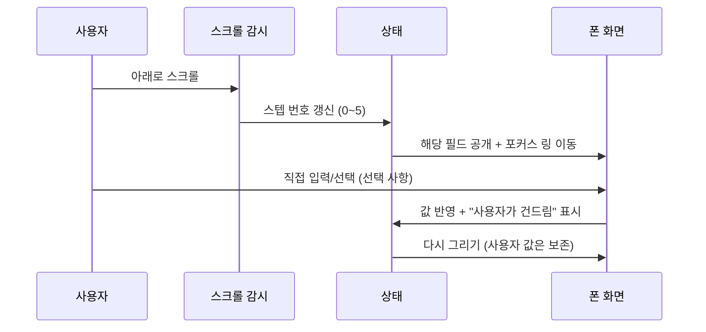

# 틈(TEUM) 온보딩 페이지 — 기능 명세서

> 동작을 재현하는 데 필요한 **모든 규칙과 알고리즘**을 담았다. 소스코드 없이 이 문서만 보고 구현할 수 있다.
> 짝 문서: [SPEC_00_README.md](SPEC_00_README.md) · [SPEC_01_CONTENT.md](SPEC_01_CONTENT.md) · [SPEC_02_DESIGN.md](SPEC_02_DESIGN.md)

**근거 표기:** `SP-SB-Edit-0N` = Figma 기능명세서의 해당 화면 번호.
그 표시가 있는 규칙은 **디자인 결정이 아니라 명세 원문**이므로 임의로 바꾸면 안 된다.

---

## 1. 전체 동작 한눈에



**핵심 개념 세 가지**

1. **스텝(step)** — 0~5. 오른쪽 카드가 화면 중앙에 오면 바뀐다. `-1`은 스크롤 전 초기 상태
2. **공개(reveal)** — 각 필드는 정해진 스텝에 도달해야 값이 보인다. 그 전엔 플레이스홀더
3. **건드림(touched)** — 사용자가 직접 입력한 필드는 스크롤해도 값이 유지된다

---

## 2. 상태 모델

프레임워크·스토어 없이 **객체 하나**로 관리한다.

### 2-1. 상태 값

| 키 | 타입 | 초기값 | 설명 |
| --- | --- | --- | --- |
| `step` | 정수 | `-1` | 현재 스텝. `-1` = 스크롤 전 |
| `service` | 문자열 | `Netflix 프리미엄` | 서비스명 |
| `date` | 문자열 | `2026-09-27` | 첫 결제일. **내부는 항상 `YYYY-MM-DD`** |
| `cycle` | 문자열 | `1` | 결제 주기(개월 수). 숫자만 |
| `price` | 문자열 | `17,000` | 결제 금액. **쉼표 포함 문자열** |
| `payment` | 문자열 | `개인 카드` | 결제 수단 별칭 |
| `trialdays` | 문자열 | `14` | 무료 체험 기간(일) |
| `trial` | 불리언 | `true` | 무료 체험 토글 |
| `notify` | 불리언 | `true` | 알림 토글 |
| `saved` | 불리언 | `false` | 저장 성공 여부 |
| `failed` | 불리언 | `false` | 저장 실패 여부 |

**별도 집합** `touched` — 사용자가 직접 건드린 키를 담는다 (`service`, `date`, `cycle`, `price`, `trialdays`, `payment`, `trial`, `notify`).

### 2-2. 필드 ↔ 스텝 매핑 (공개 순서)

| 필드 | 공개 스텝 |
| --- | --- |
| 서비스명 | 0 |
| 첫 결제일 | 1 |
| 결제 주기 | 2 |
| 결제 금액 | 3 |
| 무료 체험 기간 | 4 |
| 결제 수단 | 4 |

> ⚠️ **무료 체험 기간과 결제 수단이 둘 다 4인 것은 의도된 것이다.**
> 스텝 5(`05 · DETAIL`)에서 두 필드가 함께 공개되기 때문. "중복 버그"로 보고 고치지 말 것.
> 파란 포커스 링은 아래 규칙으로 **항상 하나만** 정해진다.

**포커스 링 대상 결정**

```
무료체험켜짐 = (step ≥ 4 또는 touched에 trial 있음) 그리고 trial == true

if step == 4:
    링 = 무료체험켜짐 ? "무료 체험 기간" : "결제 수단"
else:
    링 = 공개스텝이 현재 step과 같은 첫 번째 필드   (step 5면 해당 없음 → 링 없음)
```

### 2-3. 필수 항목

`서비스명`, `첫 결제일`, `결제 주기`, `결제 금액` 4개.
**결제 수단은 선택 항목**이다 (`SP-SB-Edit-07`: "사용자가 아무런 입력 없이 넘어가도 등록에 지장을 주면 안 됨").

---

## 3. 다시 그리기(render) 절차

값이 바뀔 때마다 아래를 통째로 다시 계산한다.

1. `무료체험켜짐`과 `포커스 링 대상`을 먼저 구한다 (§2-2)
2. 필드 6개 각각에 대해:
   - `공개됨 = (step ≥ 그 필드의 공개스텝) 또는 (touched에 있음)`
   - `표시값 = 공개됨 ? 상태값 : 빈 문자열`
   - **완료 표시(✓)** = `공개됨 그리고 표시값이 비어있지 않음`
   - **포커스 링** = 이 필드가 §2-2에서 정한 대상일 때만
   - 입력 요소에 값 쓰기 — **단, 지금 포커스가 그 입력에 있으면 건너뛴다** (커서 튐 방지)
   - 값이 비었으면 플레이스홀더 색 클래스를 붙인다
   - 서비스명이면: 카탈로그에서 로고 경로를 찾아 왼쪽 아이콘을 보이거나 숨긴다
   - 금액이면: 값이 있을 때만 `원` 표시
   - 주기·체험기간이면: 값이 있을 때만 단위(`개월`/`일`) 표시
   - 첫 결제일이면: 다음 결제일 힌트를 계산해 표시하거나 숨긴다 (§6 F-12)
3. 토글 2개의 켜짐 상태를 반영한다
   - 무료 체험 = `무료체험켜짐`
   - 알림 = `(step ≥ 5 또는 touched에 notify 있음) 그리고 notify == true`
4. 무료 체험 확장 영역을 펼치거나 접는다 (`무료체험켜짐` 기준)
5. 저장 버튼 활성화를 계산한다 (§6 F-10)
6. 스텝 카드 6장 중 현재 스텝만 활성 표시
7. 폰 변형 변수 3개를 갱신한다 (`SPEC_02_DESIGN.md` §9-4)
8. 포커스 링이 걸린 필드를 **폰 화면 안에서 가운데로 부드럽게 스크롤**한다 (reduced-motion이면 생략)

---

## 4. 스텝 카드의 선택 버튼

오른쪽 카드의 작은 버튼들은 폰을 원격 조작하는 리모컨이다.
같은 그룹 안에서 하나를 누르면 그 버튼만 "선택됨" 표시가 된다.

| 스텝 | 버튼 | 동작 |
| --- | --- | --- |
| 1 | `“netf” 검색` `“왓” 검색` `“apple” 검색` | 검색창에 그 글자를 넣고 자동완성을 연다 (상태는 안 바꿈) |
| 2 | `9월 27일` `10월 4일` | 첫 결제일을 `2026-09-27` / `2026-10-04`로 설정 |
| 2 | `달력 열어보기` | 캘린더 팝업을 연다 |
| 3 | `매월` `3개월` `매년` | 주기를 `1` / `3` / `12`로 설정 |
| 4 | `17,000원` `13,500원` | 금액을 `17,000` / `13,500`으로 설정 |
| 5 | `무료 체험 켜기` | 무료 체험 ON + touched 등록 |
| 5 | `체험 30일` | 체험 기간을 `30`으로 설정 |
| 5 | `개인 카드` | 결제 수단을 `개인 카드`로 설정 |
| 6 | `결제 3일 전 알림` | 알림 ON |
| 6 | `미리 저장해 보기` | 저장 **성공** 흐름 실행 |
| 6 | `저장 실패 화면` | 저장 **실패** 토스트 재현 (데모 전용) |

- 검색 버튼과 달력 버튼은 상태를 바꾸지 않으므로 다시 그리기를 하지 않고 즉시 끝낸다
- 나머지는 상태를 바꾼 뒤 다시 그린다

---

## 5. 콘텐츠 무결성 규칙 ⚠️

이 페이지에는 **출처가 다른 세 종류의 숫자**가 섞여 있다. 구분이 사라지면 허위 표시가 된다.

| 종류 | 표기 방법 | 해당 항목 |
| --- | --- | --- |
| **실측 조사 수치** | 그대로 쓰되 **출처 각주 필수** | 66.1% / 47% / 48% / 15% / 56% / 49% / 82% / 42% / 59% / 54.2% |
| **베타 목표치 (실측 아님)** | **주황 칩 + `베타 목표 · ` 접두사 필수** | 과업 성공률 90%, 원치 않는 자동결제 0건, 공식 서비스 이동률 30% |
| **가상 사례** | **뱃지 `가상 사례 · 페르소나 기반` + 섹션 리드문에 명시** | 김도현, 박서연 |

**출처:** 대한상공회의소·마크로밀 엠브레인(2025), Bango(2024), Omdia(2024), 서울시 구독서비스 실태조사(2025), 자체 설문(n=100)

**규칙 3개**
1. 베타 목표치를 달성 수치처럼 쓰지 않는다
2. 가상 인물을 실제 후기처럼 쓰지 않는다. 실제 후기로 교체할 때 뱃지를 뗀다
3. **서비스 카탈로그에 가격을 추가하지 않는다.** 넷플릭스 3개만 Figma 명세에 있는 값이고, 나머지 97개에 가격을 넣으면 근거 없는 구독료를 페이지가 주장하게 된다

---

## 6. 기능별 상세

### F-01 · 스크롤 ↔ 스텝 연동

| 항목 | 내용 |
| --- | --- |
| 방식 | 교차 관찰(IntersectionObserver). 감시 영역을 **위아래 38%씩 잘라** 화면 중앙 24% 밴드만 남긴다 |
| 대상 | 스텝 카드 6장 |
| 동작 | 카드가 밴드에 들어오면 그 카드의 번호로 스텝을 바꾼다 |

**스텝 전환 절차**
```
if 새 스텝 == 현재 스텝: 아무것도 하지 않고 종료   ← 중요
현재 스텝 = 새 스텝
saved = false, 토스트 숨김
다시 그리기
if 새 스텝 == 0 그리고 이전 스텝 ≠ 0 그리고 서비스명을 사용자가 안 건드렸으면:
    검색창에 "netf"를 넣고 자동완성을 연다      ← 스텝 1의 시연
else if 새 스텝 ≠ 0: 자동완성 닫기
if 새 스텝 ≠ 1: 캘린더 닫기
if 새 스텝 ≥ 5: 잠시 뒤(60ms) 저장 버튼이 보이도록 폰 화면을 아래로 스크롤
```

> **첫 줄의 "같으면 종료"가 없으면** 같은 스텝이 반복 통지될 때마다 저장 완료 상태가 초기화된다.
> (실제로 겪은 버그 — 저장 직후 버튼이 `저장하기`로 되돌아갔다.)

**reduced-motion일 때:** 감시를 아예 걸지 않고 **즉시 스텝 5**로 두어 완성된 폼을 보여준다.

### F-02 · 서비스명 자동완성 — `SP-SB-Edit-02`

**입력 규칙 (명세)**
- 최소 2자 / 최대 30자
- 문자열 `NULL` 입력 불가 (대소문자 무시)
- 자동완성 결과를 고르지 않고 **직접 입력해도 된다**

**검색 알고리즘**
```
검색어를 앞뒤 공백 제거
비어 있으면 결과 없음
카탈로그 100행 중, (한글 이름 또는 영문 이름)에 검색어가 부분 포함되면 히트 (대소문자 무시)
앞에서 최대 4개만 사용
```

**행 렌더링**
- 로고 / 이름 / 부제(있으면) / 가격(있으면)
- **이름에서 검색어와 일치하는 부분만 파란색**으로 칠한다
  - 일치 위치를 찾아 `앞부분 + 강조(일치부분) + 뒷부분`으로 나눈다
  - 대소문자를 무시하고 찾되, **표시는 원본 대소문자 그대로**
  - 예: `netf` 검색 → `Netf`가 파랑, `lix 프리미엄`은 기본색
- 결과가 없으면 `검색 결과가 없어요. 직접 입력해도 괜찮아요.` 한 줄

> **보안:** 이름을 HTML로 삽입하기 전에 `&`, `<`, `>`, `"`를 반드시 이스케이프한다.
> 카탈로그를 외부 API로 바꿔도 이 처리를 유지해야 한다.

**행 선택 시**
1. 서비스명을 그 행의 이름으로 설정하고 touched에 등록
2. 그 행에 가격이 있으면 **결제 금액까지 함께 설정**하고 touched에 등록
3. 패널을 닫고 다시 그린 뒤 입력창 포커스를 뗀다

**패널 여닫기**
| 상황 | 결과 |
| --- | --- |
| 입력창에 글자가 있음 | 열림 |
| 입력창이 비었음 | 닫힘 |
| 입력창 포커스 + 글자 있음 + 현재 스텝 0 | 열림 |
| `Escape` | 닫힘 |
| 패널·입력창 바깥 클릭 | 닫힘 |
| 스텝이 0이 아닌 곳으로 이동 | 닫힘 |
| 이탈 모달 열림 | 닫힘 |

### F-03 · 첫 결제일 직접 입력 — `SP-SB-Edit-03`

**입력 요소는 일반 텍스트 입력이다.** (브라우저 기본 날짜 선택기가 아니다 — 명세 화면을 재현하기 위함)

| 항목 | 내용 |
| --- | --- |
| 화면 표시 | `YYYY. MM. DD` (예: `2026. 09. 27`) |
| 내부 저장 | `YYYY-MM-DD` |
| 최대 길이 | 12 |

**숫자 입력 해석 규칙 (명세)** — 입력에서 숫자만 뽑아 자릿수로 판단한다.

| 자릿수 | 해석 | 예 |
| --- | --- | --- |
| 8 이상 | `YYYYMMDD` | `20261004` → 2026-10-04 |
| 6 | `YYMMDD` (20YY) | `261004` → 2026-10-04 |
| 5 | `YYMDD` (20YY, 1자리 월) | `26104` → 2026-01-04 |
| 4 | `YYMD` (20YY, 1자리 월·일) | `2614` → 2026-01-04 |
| 3 | `MDD` (연도는 올해) | `104` → 올해-01-04 |
| 1~2 | `DD` (연·월은 이번 달) | `27` → 이번 달 27일 |

- 연·월이 빠지면 **시스템의 연·월**로 채운다
- 월이 1~12 밖이거나 일이 1~31 밖이면 실패
- **존재하지 않는 날짜 거부:** 만든 날짜 객체의 월·일이 입력과 다르면(예: 2월 30일 → 3월 2일로 넘어감) 실패로 본다
- 실패하면 빈 값을 돌려주고 **기존 값을 유지**한다

**적용 시점**
- 타이핑 중: 파싱에 성공하고 그 날짜가 오늘 이후이면 상태에 반영. 화면 글자는 건드리지 않는다
- 포커스를 잃을 때: 다시 파싱해 정규화하고 `YYYY. MM. DD`로 다시 그린다. 오늘 이전이면 이전 값 유지

### F-04 · 캘린더 팝업 — `SP-SB-Edit-03`

**열기:** 필드 오른쪽 달력 아이콘 버튼 / 스텝 2의 `달력 열어보기` 버튼
**닫기:** `×` 버튼 / 오버레이 바깥 클릭 / 날짜 선택 / 스텝 1을 벗어남 / 이탈 모달 열림

**처음 보여줄 달**
```
기준 = (저장된 날짜가 있고 그것이 오늘 이후) ? 저장된 날짜 : 오늘
그 날짜의 연·월을 표시
```

**달력 그리기**
1. 제목을 `YYYY년 M월`로 (월은 앞자리 0 없이)
2. 그 달 1일의 요일만큼 **보이지 않는 빈 칸**을 앞에 채운다
3. 1일부터 말일까지 버튼을 만든다. 각 날짜에:
   - 요일 계산 → 일요일이면 빨강, 토요일이면 파랑
   - 오늘이면 `오늘` 표시(배경 원)
   - 현재 선택된 날짜면 `선택` 표시(파란 배경)
   - **오늘 이전이면 비활성** (회색, 클릭 불가)
4. 활성 날짜를 누르면: 상태에 반영 + touched 등록 + 팝업 닫기 + 다시 그리기

**월 이동:** `‹` `›`로 −1 / +1개월. 0월 미만이면 전년 12월로, 12월 초과면 다음 해 1월로 넘긴다.

> ⚠️ **"오늘 이전 비활성"은 Figma 원문이다.**
> 원문: *현재 시스템 날짜에 배경원(#F0F7FF)을 적용한 뒤 기준으로 하여, 이전 날짜는 회색(#98A2B3)으로 비활성화하여 선택불가 처리*
> "첫 결제일인데 왜 과거를 못 고르지?"라는 의문이 들지만 명세대로다. 바꾸려면 Figma부터 바꿀 것.
> (이 페이지의 초기 카피는 반대로 적혀 있었고, 그것이 오류였다.)

### F-05 · 결제 주기 — `SP-SB-Edit-04`

| 항목 | 내용 |
| --- | --- |
| 입력 | 숫자만, 최대 2자리 |
| 범위 | **1 ~ 99. `0` 불가** |
| `개월` | 입력값이 아니라 **고정 텍스트**. 색 `#4B4E58`. 값이 있을 때만 표시 |

**정규화**
```
숫자만 남기고 앞 2자리까지 자름
비었거나 0이면 → 빈 값
아니면 → 숫자로 바꿨다가 다시 문자열   (앞자리 0 제거: "07" → "7")
```
결과 예: `0` → `` / `07` → `7` / `999` → `99`

### F-06 · 결제 금액 — `SP-SB-Edit-05`

| 항목 | 내용 |
| --- | --- |
| 입력 | 숫자만, 최대 9자리 |
| 서식 | 입력하는 동안 **천 단위 쉼표 자동 삽입** (한국 로케일) |
| `원` | 고정 텍스트. 값이 있을 때만 표시 |

**알려진 한계:** 재서식 때문에 문자열 중간에 커서를 두고 타이핑하면 커서가 끝으로 간다.
데모 용도라 그대로 두었다. 실서비스로 옮기면 커서 위치 보정이 필요하다.

### F-07 · 무료 체험 — `SP-SB-Edit-06`

| 상태 | 결과 |
| --- | --- |
| OFF (기본) | 체험 기간 입력란 접힘 |
| ON | 체험 기간 입력란 + 안내문이 **펼쳐진다** |

- 체험 기간 입력 규칙은 F-05와 동일 (숫자 1~99, `0` 불가) + 고정 단위 `일`
- 토글을 누르면 touched에 등록되어 스크롤해도 상태가 유지된다
- **토글이 ON이면 체험 기간이 필수가 된다** (F-10)
- 안내문: `ⓘ 무료체험 기간이 종료되면 자동으로 위에 설정된 결제 금액으로 표기됩니다.`

### F-08 · 결제 수단 — `SP-SB-Edit-07`

| 항목 | 내용 |
| --- | --- |
| 성격 | **선택 항목.** 비워도 저장 가능 |
| 입력 길이 | **최대 10자** (명세: DoS 방지) |
| 문자 | 한글/영문/숫자 혼용 |
| 플레이스홀더 | `결제 수단의 별칭을 입력해주세요` |

### F-09 · 알림 설정 — `SP-SB-Edit-08`

| 항목 | 내용 |
| --- | --- |
| 명세 기본값 | **OFF** |
| 이 페이지 | 온보딩 연출상 스텝 6에서 ON으로 보여준다 |
| 동작 | 누를 때마다 켜짐/꺼짐 전환, touched 등록 |
| 의미 | 켠 상태로 저장하면 해당 구독의 알림 기능이 활성화된다 |

### F-10 · 저장하기 — `SP-SB-Edit-09`

**활성화 조건 (합성 규칙 — 필수 4개만 보면 틀린다)**

```
필수4개통과 = 서비스명·첫결제일·결제주기·결제금액 각각에 대해
              (공개됨 그리고 값이 비어있지 않음)
서비스명통과 = 서비스명 길이 ≥ 2 그리고 대문자화가 "NULL"이 아님
체험통과     = 무료체험이 꺼져 있거나, 켜져 있으면 체험 기간이 채워져 있음

활성화 = 필수4개통과 그리고 서비스명통과 그리고 체험통과
```

**버튼·토스트 상태**

| 상황 | 버튼 | 토스트 |
| --- | --- | --- |
| 조건 미충족 | 회색 비활성 `저장하기` | — |
| 조건 충족 | 파랑 `저장하기` | — |
| 저장 성공 | 초록 `저장됐어요` | `구독 등록 완료. 이제 틈이 챙길게요.` |
| 저장 실패 | 파랑 `저장하기` 유지 | `⚠ 저장에 실패했어요. 다시 시도해주세요.` (어두운 토스트, `⚠`만 빨강) |

**저장 절차**
```
저장(실패여부):
    if 버튼이 비활성 그리고 실패여부가 아님: 아무것도 안 함
    saved = 실패여부의 반대, failed = 실패여부
    다시 그리기
    토스트 문구와 색을 상황에 맞게 설정
    토스트 표시
    이전 타이머가 있으면 취소하고, 2.6초 뒤 토스트 숨김 타이머 설정
```

- **실패 흐름은 데모 전용이다.** 실제 실패 조건이 없고, 스텝 6의 `저장 실패 화면` 버튼으로만 재현한다
- ⚠️ 저장 버튼의 클릭 처리를 연결할 때 **클릭 이벤트 객체가 "실패여부" 인자로 넘어가지 않게** 해야 한다.
  그대로 넘기면 이벤트 객체가 참으로 평가되어 **항상 실패 토스트가 뜬다.** (실제로 겪은 버그)

### F-11 · 이탈 확인 모달 — `SP-SB-Edit-01`

| 항목 | 내용 |
| --- | --- |
| 여는 방법 | 폰 상단 `← 구독 등록/수정` 클릭 또는 Enter / Space |
| 열 때 | 자동완성과 캘린더를 먼저 닫는다 |
| `계속 작성하기` | 모달만 닫는다 |
| `나가기` | touched를 모두 비우고, 저장·실패 상태 초기화, 토스트 숨김, 체험 영역 맨 위로 부드럽게 스크롤 → **체험 리셋** |
| 바깥 클릭 | 닫힘 |

### F-12 · 다음 결제일 자동 계산 (명세 외 · 페이지 자체 기능)

첫 결제일 필드 아래에 `다음 결제일 YYYY. MM. DD`를 보여준다.

**알고리즘**
```
날짜나 주기가 비어 있으면 → 표시 안 함
주기를 정수로 해석 (예: "3" → 3개월)
기준 = 첫 결제일 (그 날 00:00)
오늘 = 오늘 00:00
반복: 기준이 오늘보다 이전이면 기준에 주기(개월)를 더한다
      (무한 루프 방지 상한 600회)
결과를 "YYYY. MM. DD"로 표시
```

**검증 예시** (오늘 = 2026-09-08 가정)

| 첫 결제일 | 주기 | 결과 |
| --- | --- | --- |
| 2026-09-27 | 1개월 | `2026. 09. 27` (미래면 그대로) |
| 2024-01-15 | 1개월 | `2026. 09. 15` |
| 2024-01-15 | 3개월 | `2026. 10. 15` |
| 2024-01-15 | 12개월 | `2027. 01. 15` |
| 빈 값 | 1개월 | 표시 안 함 |
| 2024-01-15 | 빈 값 | 표시 안 함 |
| 해석 불가 | 1개월 | 표시 안 함 |

### F-13 · 사용자 입력 보존 (touched)

스크롤할 때마다 화면을 다시 그리므로, 방어가 없으면 **사용자가 친 값이 스크롤만으로 사라진다.**
두 겹으로 막는다.

1. 입력 이벤트에서 **상태 자체를 갱신**하고 touched에 등록한다
   → 다시 그리기가 같은 값을 다시 쓰므로 값이 유지된다
2. 다시 그리기는 **지금 포커스가 있는 입력에는 값을 쓰지 않는다**
   → 타이핑 중 커서가 튀지 않는다

**필수 회귀 테스트**
> 금액에 `9900` 입력 → 스텝 0까지 위로 스크롤 → 스텝 5까지 내려오기 → 값이 `9,900`으로 남아 있어야 한다.

### F-14 · 연출 요소

| 요소 | 동작 |
| --- | --- |
| 스크롤 진행바 | 스크롤 이벤트마다 `스크롤위치 ÷ (문서높이 − 화면높이)`를 0~1로 잘라 가로 비율에 반영 |
| 등장 애니메이션 | 대상이 화면에 12% 들어오면 나타나게 하고 **감시를 해제**한다 (1회성) |
| 커서 추적 배경 | 마우스 좌표를 계수 0.055로 보간해 배경 그라디언트 중심으로 사용. `requestAnimationFrame` 루프 |
| 폰 미세 변형 | 스텝 값으로 세로 이동·회전·후광 크기를 계산 (`SPEC_02_DESIGN.md` §9-4) |

- 스크롤·포인터 리스너는 `{ passive: true }`로 등록한다

### F-15 · 최종 CTA

클로징의 `틈 서비스 시작하기 →` 버튼은 **아직 실서비스 URL이 없다.**
현재는 클릭을 가로채 "실제 서비스 URL이 준비되면 링크를 교체해달라"는 안내를 띄운다.
URL이 정해지면 그 자리에 넣고 가로채기를 제거하면 된다.

---

## 7. 예외 · 경계 조건 모음

| 상황 | 기대 동작 |
| --- | --- |
| 자동완성 검색 결과 0건 | 안내 문구 표시, 직접 입력 허용 |
| 서비스명 1자 | 저장 비활성 |
| 서비스명 `NULL` / `null` | 저장 비활성 |
| 주기 `0` 입력 | 빈 값이 되고 저장 비활성 |
| 주기 `999` 입력 | `99`로 잘림 |
| 금액 10자리 이상 | 9자리에서 잘림 |
| 존재하지 않는 날짜 입력 | 무시하고 이전 값 유지 |
| 오늘 이전 날짜 입력 | 무시하고 이전 값 유지 |
| 캘린더에서 오늘 이전 날짜 클릭 | 반응 없음 (비활성) |
| 무료 체험 ON + 기간 비움 | 저장 비활성 |
| 결제 수단 비움 | **저장 가능** (선택 항목) |
| 같은 스텝 반복 통지 | 무시 (저장 상태 유지) |
| 저장 후 토스트가 뜬 상태에서 다시 저장 | 이전 타이머 취소하고 새로 2.6초 |
| 폼이 폰 화면보다 길어짐 | 폰 화면이 세로로 스크롤됨 |
| reduced-motion | 스크롤 감시 없이 즉시 최종 상태 표시 |

---

## 8. 알려진 한계 / 다음 작업

| # | 내용 |
| --- | --- |
| 1 | 백엔드 없음 — 저장은 UI 연출뿐, 어디에도 전송되지 않는다 |
| 2 | 최종 CTA에 실서비스 URL 미연결 (F-15) |
| 3 | 금액 입력 시 커서가 끝으로 튐 (F-06) |
| 4 | 한국어 전용. 다국어 전환 없음 (영문 카피 원고는 별도 파일에 있음) |
| 5 | 다크 모드 수동 토글 없음 — OS 설정만 따름 |
| 6 | 서비스 카탈로그 100행이 코드에 하드코딩. API로 바꾸면 이스케이프 처리 유지 필수 (F-02) |
| 7 | 폼이 길어지면 폰 상단 뒤로가기 버튼이 스크롤 밖으로 밀린다 |
| 8 | 무료 체험 영역이 `max-height: 170px` 기준이라 필드를 더 넣으면 잘린다 |

---

## 9. 회귀 체크리스트

만든 뒤 최소한 이것만은 확인한다.

**레이아웃**
- [ ] 데스크톱에서 스크롤할 때 **폰이 화면에 고정**되어 따라오는가
- [ ] 375px에서 가로 스크롤이 없는가
- [ ] 다크 모드에서 결과 섹션·보드·토스트·폰 내부가 깨지지 않는가

**스텝 연동**
- [ ] 스크롤하면 필드가 하나씩 채워지고 파란 링이 한 칸씩 옮겨가는가
- [ ] 파란 링이 **동시에 두 필드에 뜨지 않는가**

**서비스명**
- [ ] `netf` 입력 → 넷플릭스 3행 + 로고, `Netf` 부분만 파란색
- [ ] `왓` → 왓챠 1행 / `apple` → 애플 TV+·애플 뮤직 2행
- [ ] 요금제 선택 → 서비스명·로고·금액이 한 번에 채워지는가
- [ ] 1자 입력 / `NULL` 입력 시 저장 비활성

**날짜**
- [ ] 필드에 `20261004` → `2026. 10. 04`로 바뀌는가
- [ ] 캘린더에서 오늘 이전 날짜가 회색이고 클릭되지 않는가
- [ ] 오늘 날짜에 배경 원, 선택일에 파란 배경
- [ ] `‹` `›`로 달 이동, 연도 경계(12월↔1월)에서도 정상

**숫자**
- [ ] 주기 `0` → 빈 값 + 저장 비활성 / `07` → `7` / `999` → `99`
- [ ] 금액 `17000` → `17,000` + `원` 표시

**무료 체험 · 저장**
- [ ] 토글 ON → 기간 입력란이 펼쳐지고 안내문이 보이는가
- [ ] 기간을 비우면 저장 비활성
- [ ] 저장 → 초록 `저장됐어요` + **성공** 토스트 (실패 토스트가 아님)
- [ ] `저장 실패 화면` 버튼 → 빨간 `⚠` 실패 토스트

**입력 보존**
- [ ] 금액 입력 → 위아래로 크게 스크롤 → 값이 유지되는가

**기타**
- [ ] 폰 상단 `←` 클릭 → 마스코트 모달, `나가기`로 리셋
- [ ] 콘솔 에러 0, 깨진 이미지 0
- [ ] OS를 애니메이션 줄이기로 두면 전체 내용이 정적으로 다 보이는가
